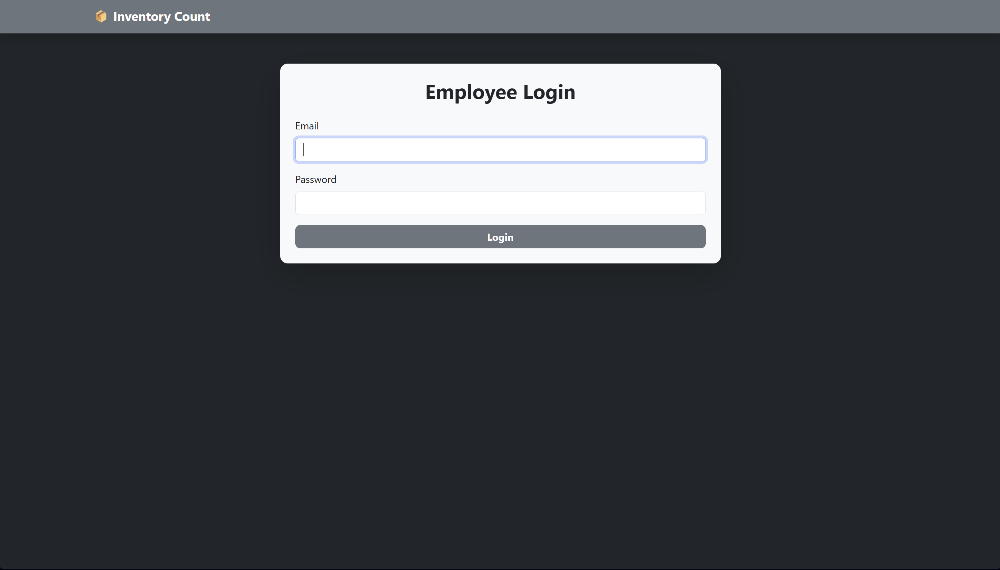

#  Inventory Count Webapp

A **photo-based inventory tracking solution** built for a construction company to simplify internal stock audits.  
The app reduces the need for warehouse visits by enabling employees to upload, view, and manage product photos linked to unique product IDs and warehouse names.

Deployed live on **Render** for real-world business use.

---

##  Features

- Employee login (provisioned securely via Supabase)
- Upload or capture inventory photos per product ID
- Real-time photo preview before upload
- Delete functionality to manage outdated photos
- Unique URL system:  
  `base_url/productId+warehouseName` → provides direct links from Excel for faster audits
- Photos stored in **Supabase buckets** for secure and scalable storage
- Simple, responsive Bootstrap interface

---

##  Screenshots

- **Login Page**  
  

- **Upload Photo Screen** 
  

- **View Photo Screen**  
  

---

##  Architecture

- **Flask (Python)** → Handles routes, authentication, and integration with Supabase  
- **Supabase** → Authentication + storage (buckets for inventory photos)  
- **Bootstrap** → Provides clean, responsive UI  
- **Render** → Deployment for real-world accessibility  

##  Business Impact

- **Reduced warehouse visits** → saves significant time and travel costs  
- **Faster internal stock audits** → managers check photos remotely instead of in person  
- **Secure access control** → employees are provisioned accounts directly via Supabase upon manager's request
- **Scalable and simple** → works across multiple warehouses and product lines  

---

##  Tech Stack

- **Backend:** Flask (Python)  
- **Frontend:** Bootstrap 5  
- **Auth & Storage:** Supabase (Auth + Buckets)  
- **Deployment:** Render  

---

##  Possible Future Improvements

- Role-based access (manager vs employee views). This will allow the manager to create accounts for employees from the frontend.
- Integration with inventory management systems

---

